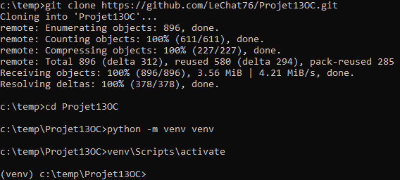
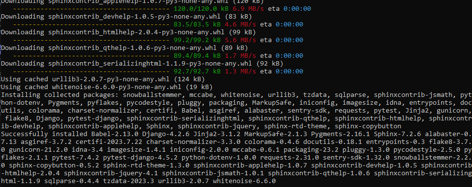

====================
Project installation
====================

First, you need to install latest version of:
 - `Python <http://www.python.org/>`_
 - `Git <https://git-scm.com/downloads>`_

Then, follow steps bellow to install and start the application:

- open an command line interface and clone the repository of this project :

.. code-block:: bash

    git clone https://github.com/LeChat76/Projet13OC.git

- go in the created folder Projet13OC :

.. code-block:: bash

    cd Projet13OC

- create virtual environnement :

.. code-block:: bash
    
    python -m venv venv

- activate it:
   * with Linux source 

    .. code-block:: bash

        venv/bin/activate

   * with Windows

    .. code-block:: bash

        venv\Scripts\activate

- install dependancies :

.. code-block:: bash
    
    pip install -r requirements.txt

