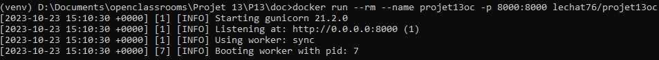

=================
Start the project
=================

You can start the project by 2 ways.

--------------------------
From the cloned repository
--------------------------

From the root folder of the cloned project (where is located the file **manage.py**) and with virtual environment activated

.. code-block:: bash

    python .\manage.py runserver

Then, from your favorite web browser, go to:

.. code-block:: bash

    http://localhost:8000

.. _build:

-----------------
From Docker image
-----------------

Build and push image to Docker Desktop (from any folder you want):

.. code-block:: bash

    docker build -t lechat76/projet13oc:latest .

Then, start web server

.. code-block:: bash

    docker run --rm --name projet13oc -p 8000:8000 lechat76/projet13oc

or with graphic interface

.. image:: images/3-4.PNG

Finally, from your favorite web browser, go to:

.. code-block:: bash

    http://localhost:8000